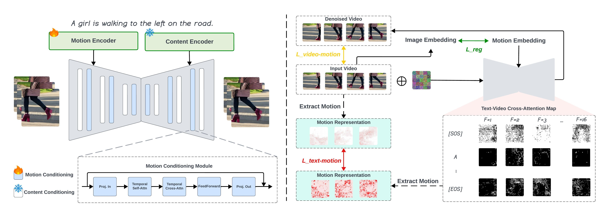

<!-- Improved compatibility of back to top link: See: https://github.com/othneildrew/Best-README-Template/pull/73 -->
<a id="readme-top"></a>
<!--
*** Thanks for checking out the Best-README-Template. If you have a suggestion
*** that would make this better, please fork the repo and create a pull request
*** or simply open an issue with the tag "enhancement".
*** Don't forget to give the project a star!
*** Thanks again! Now go create something AMAZING! :D
-->


<!-- PROJECT SHIELDS -->
<!--
*** I'm using markdown "reference style" links for readability.
*** Reference links are enclosed in brackets [ ] instead of parentheses ( ).
*** See the bottom of this document for the declaration of the reference variables
*** for contributors-url, forks-url, etc. This is an optional, concise syntax you may use.
*** https://www.markdownguide.org/basic-syntax/#reference-style-links
-->

<!-- 
<!-- Centered Title and Authors -->
<h3 align="center">Enhancing Motion in Text-to-Video Generation with Decomposed Encoding and Conditioning</h3>

<p align="center">
  <a href="https://pr-ryan.github.io/">Penghui Ruan</a><sup>1,2</sup>,
  <a href="https://wangpichao.github.io/">Pichao Wang</a><sup>3</sup>,
  <a href="https://www.polyu.edu.hk/comp/people/academic-staff/dr-saxena-divya/">Divya Saxena</a><sup>1</sup>,
  <a href="https://www4.comp.polyu.edu.hk/~csjcao/">Jiannong Cao</a><sup>1</sup>,
  <a href="https://www.sustech.edu.cn/en/faculties/shiyuhui.html">Yuhui Shi</a><sup>2</sup>
</p>
<p align="center"><sup>1</sup> The Hong Kong Polytechnic University, Hong Kong</p>
<p align="center"><sup>2</sup> Southern University of Science and Technology, Shenzhen</p>
<p align="center"><sup>3</sup> Amazon, United States</p>

<p align="center">Accepted at NeurIPS 2024 (Poster)</p>

---


### Slow motion flower petals fall from a blossom, landing softly on the ground.

| <br><p align="center">Lavie</p> | <br><p align="center">VideoCrafter2</p> | <br><p align="center">ModelScope</p> | <br><p align="center">DEMO</p> |
|-------|---------------|-------------------------|------|

---

### An old man with white hair is shown speaking.

| <br><p align="center">Lavie</p> | <br><p align="center">VideoCrafter2</p> | <br><p align="center">ModelScope</p> | <br><p align="center">DEMO</p> |
|-------|---------------|-------------------------|------|

---

### Jockeys racing.

| <br><p align="center">Lavie</p> | <br><p align="center">VideoCrafter2</p> | <br><p align="center">ModelScope</p> | <br><p align="center">DEMO</p> |
|-------|---------------|-------------------------|------|


<!-- GETTING STARTED -->

### 1. Getting Started

#### Install FFmpeg

To save videos, FFmpeg is required. Install it using the following command:

```bash
sudo apt-get update && sudo apt-get install ffmpeg libsm6 libxext6 -y
```

#### Environment Preparation

Clone the repository:

```bash
git clone git@github.com:PR-Ryan/DEMO.git
```

Set up the Python environment:

```bash
conda create -n demo python=3.8
conda activate demo
pip install -r requirements.txt
```


### 2. Inference

#### Download Pretrained Models from ModelScope (for VAE and Text Encoder)

To download pretrained models, run the following command:

```bash
bash models/download.sh
```

Alternatively, you can download directly from [Hugging Face](https://huggingface.co/ali-vilab/modelscope-damo-text-to-video-synthesis) and place the downloaded folder in `models/modelscopet2v`.

#### Download DEMO Checkpoints

Download DEMO [checkpoints](https://huggingface.co/Ryan-PR/DEMO) from Hugging Face and place the folder under `models`.

#### Prepare Inference Prompt

Create an inference prompt file at `prompts/test_prompt.csv`. Here’s an example format:

```csv
id,prompt
1,a fat dog is playing in the yard.
2,a fat car is parked by the road.
3,a fat balloon is floating in the air.
```

#### Start Inference

To start inference, run:

```bash
bash scripts/inference_deepspeed.sh
```

By default, distributed inference is enabled and all available GPUs are used. To manually specify GPUs, add the `--include` flag in the DeepSpeed command:

```bash
--include="localhost:<your gpu ids>"
```

### Inference Configuration

All configurations for inference are found in `configs/t2v_inference_deepspeed.yaml`. In this file, you can adjust the following settings:

- **`infer_dataset`**: Specify your dataset type and prompt path.
- **`batch_size`**: Set the batch size for diffusion sampling.
- **`decoder_bs`**: Define the batch size for VAE decoding.
- **`pretrained`**: Set checkpoint paths for pretrained models.

The DeepSpeed configurations for inference are located in `ds_configs/ds_config_inference.json`. You can also use a custom DeepSpeed configuration by modifying the `deepspeed_config` setting in `configs/t2v_inference_deepspeed.yaml`.

 With our optimized inference code, this model can generate video at 256x256 resolution with 16 frames on an 8GB GPU with a batch size of 1.


### 3. Training

#### Dataset Preparation

Follow the instructions to download the [WebVid-10M](https://github.com/m-bain/webvid) dataset. We provide an example training dataset in `data/webvid/train_sample.csv`. You can manually download these sample videos and place them in `data/webvid/videos` for sample training.

If you prefer to use your own dataset, refer to `tools/datasets/video_datasets.py` to define your dataset and preprocessing steps.


#### Download pretrained models from ModelScope
```bash
bash models/download.sh
```
You can also direcly download from [huggingface](https://huggingface.co/ali-vilab/modelscope-damo-text-to-video-synthesis) and place the folder as `models/modelscopet2v`


#### Train the Model

To train the model, run the following command:

```bash
bash scripts/train_deepspeed.sh
```

By default, data distributed parallel training is used, utilizing all available GPUs. If you want to manually specify the GPUs, add the `--include` flag to the DeepSpeed command:

```bash
--include="localhost:<gpu_ids>"
```

#### Training Configuration

All training configurations are in the `configs/t2v_train_deepspeed.yaml` file. You can customize the following settings:

- **`train_dataset`**: Define your dataset type and provide the prompt path.
- **`pretrained`**: Specify the checkpoint paths for pretrained models.

The DeepSpeed configurations for training are located in `ds_configs/ds_config_train.json`. You can customize these settings or provide your own DeepSpeed configuration by modifying the `deepspeed_config` parameter in `configs/t2v_train_deepspeed.yaml`.

#### Key DeepSpeed Settings

In `ds_config/ds_config_train.json`, you can specify:

- **`train_micro_batch_size_per_gpu`**: The batch size for each GPU.
- **`gradient_accumulation_steps`**: Number of steps for gradient accumulation.
- **`zero_optimization`**: Configurations for DeepSpeed's ZeRO optimization. By default, we use stage 2 with optimizer offloading to the CPU, which may increase CPU memory usage. Disable this if you have limited CPU memory. If your GPUs have large memory, you can switch to stage 1 for faster convergence.
- **`optimizer`**: By default, we use DeepSpeed's highly optimized CPU Adam for faster training, which requires compiling with `nvcc` during the first run. You may need to set `CUDA_HOME` and `LD_LIBRARY_PATH` environment variables. Alternatively, you can simply skip this by switching to another optimizer in `ds_config/ds_config_train.json`. Refer to the [DeepSpeed documentation](https://www.deepspeed.ai/) for more information.

> **Note**: Ensure that your `nvcc` version matches the version used to compile PyTorch. If it does not, you can install `nvcc` within your Conda environment and set the `CUDA_HOME` and `LD_LIBRARY_PATH` to point to the Conda-installed `nvcc`. For more details, refer to the [CUDA Installation Guide](https://docs.nvidia.com/cuda/cuda-installation-guide-linux/#conda-installation).


#### Monitor Training

TensorBoard is enabled by default for monitoring the training process. To view the training progress, launch TensorBoard with:

```bash
tensorboard --logdir=tensorboard_log/demo
```


<!-- ROADMAP -->
## TODO

- [x] Release model weights.
- [x] Release inference and training code.
- [ ] Huggingface demo.
- [ ] Gradio application.


<!-- LICENSE -->
## License

Distributed under the MIT License. See `LICENSE.txt` for more information.


<!-- CONTACT -->
## Contact

Penghui Ruan - penghui.ruan@connect.polyu.hk

Project Link: [https://pr-ryan.github.io/DEMO-project/](https://pr-ryan.github.io/DEMO-project/)


<!-- ACKNOWLEDGMENTS -->
## Acknowledgments

This repository is largely based on [VGen](https://github.com/ali-vilab/VGen) by Alibaba. We sincerely thank them for their contributions to the open-source community.


## BibTex


